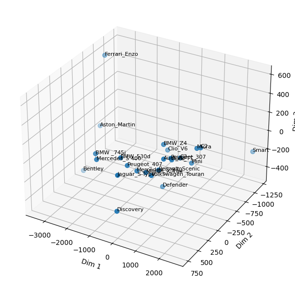
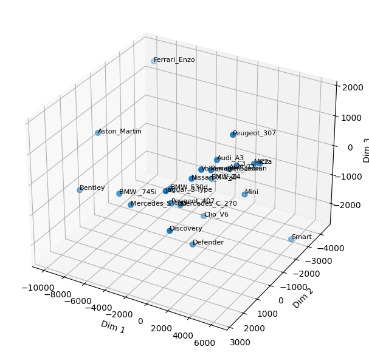

# Optimizing Multidimensional Scaling in Gini Pseudo-Metric Spaces

## Description


The  Gini  Multidimensional  Scaling  (Gini  MDS) framework extends the Euclidean multidimensional scaling. We introduce a Gini pseudo-distance based on values and their ranks that depends on a finetunable hyperparameter.  
This pseudo-distance allows  flexible  exploration  of  latent  configurations, enabling embeddings that best match observed dissimilarities.   
The  Gini  MDS  is  shown  to  be  robust to noise, making it well-suited for real world applications.  

We provide experiments on 16 UCI datasets  and  on  MNIST  images  to  show  that  the Gini  MDS  outperforms  the  Euclidean  MDS  on noisy data.

This respository contains a pytorch implementation of the Gini MDS allowing an acceleration compared to scikit-learn implementation. 

<figure>
  <p float="left">
    
    
  </p>
  <figcaption>
    <b>Figure 1.</b> Comparison of Euclidean MDS (left) and Gini MDS (right) on Cars dataset.
  </figcaption>
</figure>

---

## Installation

We use Pixi : https://pixi.prefix.dev/latest/installation/ in order to manage the Python environement needed for this project. 

1. Clone this repository:
   ```bash
   git clone git@github.com:giniknnkmeans/KNN_Kmeans_Gini_prametric.git](https://github.com/bangtan66708/MDS_Gini_pseudo_metric.git)
   cd MDS_Gini_pseudo_metric
   ```

2. Install Pixi :
   ```bash
   curl -fsSL https://pixi.sh/install.sh | bash
   ```
   Reload the shell :
   ```bash
   source ~/.bashrc
   ```

4. Install the environment:
   ```bash
   pixi install
   ```

5. Run a .py script :
   ```bash
   pixi run python MDS_UCI.py
   ```
   
---

## Usage

1. MDS_UCI.py
This file contains the experiment carried out on the 16 UCI datasets https://archive.ics.uci.edu/datasets with a comparison with euclidean distance.
```bash
   pixi run python MDS_UCI.py
 ```
2. MNIST.py
This file contains the experiment on MNIST dataset.

In order to run this file, first you need to download the MNIST dataset using the download_mnist.py file :
```bash
   pixi run python MDS_UCI.py
 ```

Then, you need to create a jupyter kernel using the Pixi environement :

```bash
   pixi run ipython kernel install --name=MDS_Gini --user
 ```
Finally, select MDS_Gini in Jupyter/VSCode and the MNIST.py file can be run. 


---
## License

This project is licensed under the [MIT](LICENSE) License. See the LICENSE file for details.

---
